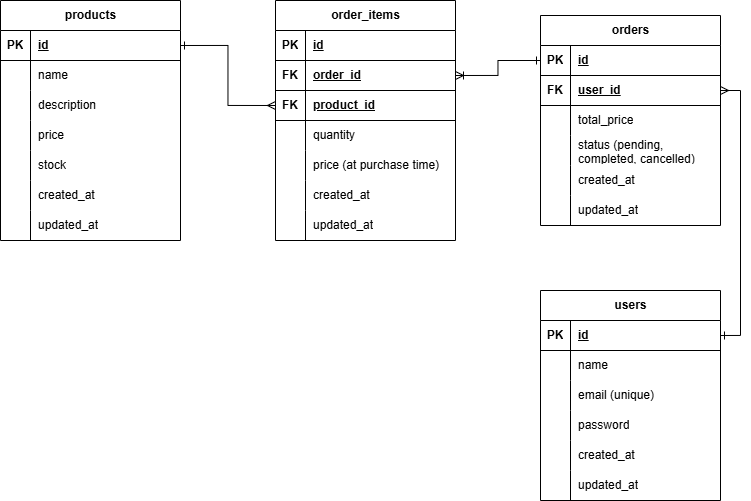

# 🛒 E-Commerce Web App (Laravel + Vue SPA)

A full-stack eCommerce application built with Laravel (backend) and Vue 3 (SPA frontend).
This project demonstrates core shopping flow including product browsing, cart management, authentication, checkout, and order history.

---

# 🚀 Features

## 🧾 Product Catalogue

* View all products
* Search products (with debounce)
* Display product details (modal)
* Show stock availability
* Dummy product images for UI enhancement

## 🛒 Cart System (Session-Based)

* Add to cart
* Update quantity (debounced)
* Remove items
* Persistent session cart
* Cart badge (total quantity)

## 🔐 Authentication

* User registration & login (Laravel Breeze)
* Only logged-in users can checkout
* Redirect back after login

## 💳 Checkout System

* Convert cart to order
* Create order items
* Calculate total price
* Deduct product stock
* Clear cart after checkout

## 📦 Order Management

* View order history
* Display purchased items with images
* Update order status (pending, completed, cancelled)
* Filter orders by status

## 🎨 UI / UX

* Vue SPA (no page reload)
* Tailwind CSS styling
* Responsive layout
* Image placeholders (Picsum)

---

# 🧱 Tech Stack

## Backend

* PHP (Laravel)
* Laravel Breeze (Authentication)
* Eloquent ORM
* MySQL 

## Frontend

* Vue 3
* Vue Router
* Axios
* Vite
* Tailwind CSS

---

# ⚙️ Installation & Setup

## 1. Clone the Repository

```bash
git clone <your-repo-url>
cd ecommerce
```

---

## 2. Install Backend Dependencies

```bash
composer install
```

---

## 3. Install Frontend Dependencies

```bash
npm install
```

---

## 4. Environment Setup

Copy `.env` file:

```bash
cp .env.example .env
```

Update database config:

```env
DB_DATABASE=your_db
DB_USERNAME=root
DB_PASSWORD=
```

---

## 5. Generate App Key

```bash
php artisan key:generate
```

---

## 6. Run Migrations & Seeders

```bash
php artisan migrate
php artisan db:seed
```

---

## 7. Start Development Servers

### Backend

```bash
php artisan serve
```

### Frontend

```bash
npm run dev
```

---

## 8. Access App

```
http://127.0.0.1:8000
```

---

# 🔑 Test Account

```
Email: test@example.com
Password: password
```

---

# 🗄️ Database Design



## Core Tables

### Users

* id
* name
* email
* password

---

### Products

* id
* name
* price
* stock
* description

---

### Orders

* id
* user_id (FK)
* total_price
* status

---

### Order Items

* id
* order_id (FK)
* product_id (FK)
* quantity
* price

---

## Relationships

* User → hasMany Orders
* Order → hasMany OrderItems
* OrderItem → belongsTo Product

---

# 🔄 Application Flow

### Guest

```
Browse products → Add to cart
```

### Checkout

```
Click checkout → Redirect to login → Login → Back to cart → Checkout
```

### Order Creation

```
Validate stock → Create order → Create order items → Deduct stock → Clear cart
```

---

# 🎯 Key Design Decisions

## Session-Based Cart

* Simpler than DB cart
* Works for guest users
* Uses Laravel session

## SPA Architecture

* Vue Router handles frontend navigation
* Laravel serves as API + auth

## Client-Side Filtering

* Order filtering done in Vue (fast, no extra API)

---

# 🧪 Future Improvements

* Product images upload (instead of dummy)
* Admin panel for product management
* Pagination for products & orders (only if data size grows)
* Payment integration
* Role-based access (admin vs user)

---

